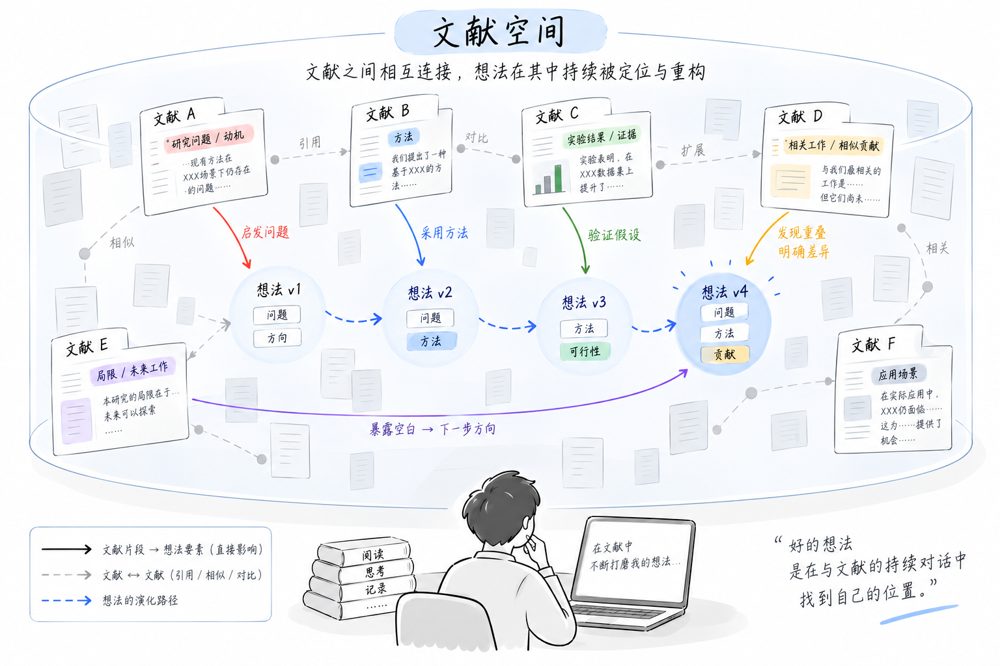
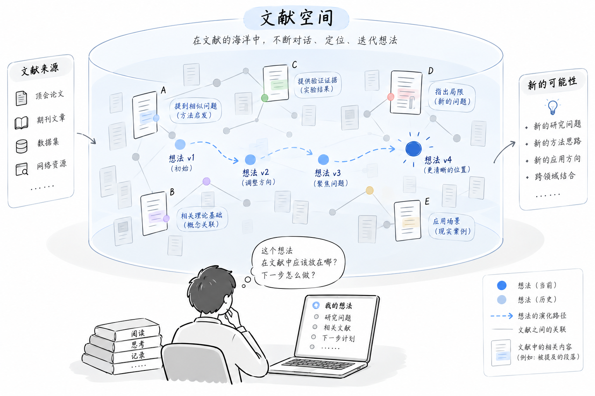

# CoResearch 空间设计：Research Wiki 与 Idea Meta Space

- 状态：设计提案 v1，尚未实现；不代表当前 CoResearch 产品已有这些能力。
- 日期：2026-09-16
- 范围：空间的产品语义、对象关系、交互、持久化边界及最小交付路径。
- 衔接：[Workspace 设计](./workspace.md)、[Research Flow](./research-flow.md)。本文细化其 Research State 层；第 9 节列出建议修订，未执行目录迁移。
- 产品交互入口是 Canvas（Commitment Space）与 Conversation（Exploration Space），见 [Research Flow](./research-flow.md)。本文的 Wiki / Meta Space 描述的是持久研究知识与 Idea 定位，不替代 Flow 的确认顺序。

## 1. 设计结论

**一个研究工作区，两个互相联动的空间：Research Wiki 积累有出处的研究知识；Idea Meta Space 展示某个想法的当前状态、文献定位与演化依据。**

用户始终围绕三个问题工作：世界里已经知道什么？我现在想做什么？新读到的内容为什么值得改变我的想法？

底层分为三部分，但不做成三个互不相通的产品：

| 部分 | 回答的问题 | 持久内容 |
|---|---|---|
| Research Wiki | 文献说了什么，彼此有什么关系？ | 来源、原文片段、结构化阅读记录、可追溯的知识关系 |
| Idea | 我现在选择研究什么？ | 想法身份、维度内容、已提交版本、待审提案、开放问题 |
| Meta | 这个想法如何被文献支持、挑战和重构？ | 片段与想法维度的锚点、版本变更理由；位置与时间线由它们计算 |

**Meta Space 是组合视图；它依赖的锚点、提案和研究决策是需要保存的领域数据。** “视图可重建”不等于“关系和决策可以不保存”。

Research Wiki 也不等于客观真理：原文、作者主张、用户解释、AI 推断必须分开。用户确认一项解释，只意味着认可记录方式，并不意味着科学结论已被证实。

## 2. 如何把两张概念图变成可操作的空间





| 图中的元素 | 产品含义 | 用户操作 |
|---|---|---|
| 包围文献的圆柱 | 一个可检索、持续积累的文献范围 | 切换专题、检索、筛选和查看阅读覆盖 |
| 文献 A—F | 来源对象及其阅读卡片 | 打开原文、阅读结构化记录 |
| 论文中的彩色段落 | 带定位的 PaperFragment | 查看上下文、选取片段、关联想法维度 |
| 灰色连接 | 文献之间的有类型关系 | 查看关系依据、区分引用与推断相似 |
| 彩色实线箭头 | 片段对特定想法版本的影响 | 查看“影响了哪一维、为什么、是否被采纳” |
| 想法 v1—v4 | 同一个想法的已提交版本 | 比较版本、回看触发材料 |
| 蓝色虚线轨迹 | 用户提交的演化过程 | 查看修改内容与决策理由 |
| 新的可能性 | 尚待判断的方向或提案 | 保存候选、编辑、采纳或拒绝 |

圆柱、漂浮纸张和发光节点作为视觉参考，不要求实现三维场景。V1 用清晰的卡片、局部关系图和时间线表达这些语义。空间距离只辅助浏览，不能当作新颖性或科学价值的分数。

## 3. 产品结构：一个入口，两种阅读重点

### 3.1 工作区布局

```text
项目 / 当前想法 / 当前版本                         搜索
┌──────────┬────────────────────────┬─────────────────┐
│ 项目导航 │ 研究内容区             │ 对话 / 上下文面板│
│          │ [想法空间] [Research Wiki]│               │
│ 想法列表 │                        │ 讨论选中内容    │
│ 文献专题 │ 当前想法 + 文献定位    │ 查看证据与提案  │
│ 开放问题 │ 或文献阅读与关系       │ 编辑 / 采纳     │
│          │                        │                 │
├──────────┴────────────────────────┴─────────────────┤
│ 演化：v1 —— v2 —— v3 —— 当前 v4                    │
└────────────────────────────────────────────────────┘
```

对话是发起研究动作的主要入口；中间的持久状态让用户随时知道讨论已经形成了什么。选中一个维度或片段时，对话明确显示讨论对象与版本。切换对象不会把原有提案自动套用到新对象。

右侧按任务切换“对话 / 原文证据 / 变更预览”，避免同时堆放多个窄面板。窄屏改为单内容区加抽屉，保留返回位置。

### 3.2 Research Wiki：从列表开始，按需展开关系

默认展示可检索的文献卡片或表格，包含标题、来源版本、阅读状态和相关专题。局部图是辅助视图：选择一篇文献后，展开它的引用、方法关联或冲突关系；不默认展示整个项目的所有节点。

论文详情包含：

1. **来源**：标题、作者、年份、DOI/arXiv ID/URL、文件或网页版本。
2. **阅读拆解**：问题、动机、方法、证据、发现、局限、未来工作、应用场景。
3. **原文片段**：原文与解释分栏，点击定位到页码、章节、表格或网页段落。
4. **文献关系**：这篇论文引用、扩展、比较了谁；每条关系有依据和来源类型。
5. **对想法的影响**：按所选 idea 和 revision 展示锚点；切换想法只改变这一栏，不改论文固有内容。

来源可包括论文、数据集和网页。V1 首先支持论文；其他来源先保存为 Source，不强行补成论文结构。没有全文时明确显示“仅摘要”，未读章节保持缺失，不用摘要推造实验或局限。

### 3.3 Idea Meta Space：先看当前想法，再看依据和变化

默认内容分为三块：

- **当前想法**：一句话概述，展开十个维度；空维度显示“尚未明确”。
- **文献定位**：理论或方法基础、最近邻工作、重叠、差异、可能的空白、反证。
- **演化历史**：已提交版本和待审提案分开展示；选中历史版本时，整页进入只读历史态。

“最近邻工作”首先是一组带理由的列表，可切换到局部图。每张卡解释相近之处，如研究问题相同、方法相似、数据集相同。没有经过校准的算法时不展示伪精确的相似度百分比。

位置图以当前想法为中心，分区摆放基础、重叠、挑战与空白候选。节点的筛选、固定位置和缩放属于个人视图设置；拖动节点不会改变领域关系。

## 4. 核心对象与边界

### 4.1 Research Wiki 的最小对象

| 对象 | 最小字段 | 约束 |
|---|---|---|
| Source / Paper | id、externalIds、title、sourceVersion、accessStatus | DOI/arXiv ID 优先去重；同一论文的新版本保留旧来源 |
| PaperFragment | id、paperId、sourceVersion、locator、quote、kind | 锚定具体来源版本；原文与 summary 分字段 |
| ReadingEntry | id、paperId、section、summary、fragmentIds、authorType | 总结能追溯至片段；无依据时标为未核实 |
| LiteratureRelation | id、from、to、type、evidenceRefs、origin、reviewStatus | 引用事实与模型推断相似不可混用 |

Fragment 的 kind 支持 problem、motivation、concept、method、evidence、finding、limitation、future_work、application、related_work。允许同一片段带多个角色；不要求每篇论文填满所有类别。

定位信息至少保存来源版本、章节或页码，以及原文引用；PDF 可增加页内区域，网页可增加文本定位。OCR 内容标记识别来源。定位失败显示“原文定位失效”，保留当时引用，不静默迁移到另一段。

Concept、Method、Claim、Dataset 可在需要跨论文复用时升为独立实体。V1 先使用阅读记录和标签，避免要求用户维护完整本体。自己的实验放在研究执行区；Wiki 可引用其结果，不能把待跑实验当成文献证据。

### 4.2 Idea：身份、版本与维度

一个 Idea 拥有稳定 id；v1—v4 是同一 id 的不同 revision。新方向如果需要与原方向同时保留，创建新 Idea 并记录 parentIdeaId 和 parentRevision；普通修改不创建新的 Idea。

采用参考文字中的十个维度作为可调整的初始模板：

| 维度 | 内容 |
|---|---|
| seed | 最初兴趣、现象或直觉 |
| problem | 要解决的具体问题及研究对象 |
| why_unsolved | 现有方法的不足及适用范围 |
| hypothesis | 可被验证或反驳的假设 |
| method | 计划采用的机制或方法 |
| novelty | 相对具体已有工作的差异 |
| evidence | 当前依据、反证与验证需求 |
| constraints | 数据、资源、时间、适用条件 |
| risks | 不成立、重叠或不可实施的风险 |
| so_what | 如果成立，会带来什么价值 |

每个维度保存 value、authoredBy、updatedAt；用户确认状态与证据状态分离：

- `decisionStatus`：draft / confirmed。只表示用户是否采纳这一表述。
- `evidenceStatus`：unassessed / supported / contested / insufficient。它是限定范围内的证据摘要，须有解释和锚点。

AI 提出的修改放入独立 Proposal，不覆盖当前 value。未知维度用空值表达，不能把“尚未找到工作”自动改写为“前人没有做过”。

### 4.3 LiteratureAnchor：两种空间之间的桥

锚点精确连接 `PaperFragment → IdeaRevision.Dimension`，最小结构如下：

```json
{
  "id": "anchor-017",
  "ideaId": "idea-001",
  "ideaRevision": 3,
  "dimension": "novelty",
  "fragmentId": "frag-paper-d-related-01",
  "sourceVersion": "paper-d-v1",
  "relation": "overlaps",
  "rationale": "已有工作覆盖了当前表述中的一部分研究目标，仍需比较适用条件。",
  "origin": "agent",
  "reviewStatus": "proposed"
}
```

允许的初始关系：inspires、provides_method、supports、contradicts、overlaps、extends、reframes、reveals_gap。relation 表示片段对想法维度的作用；rationale 必须说明比较对象及范围。

文献实验支持某个机制，不意味着它验证了用户的新假设。只有研究对象、条件、指标相符时，才能作相应强度的支持判断。`reveals_gap` 表示空白候选，不能直接等同于新颖性证明。

锚点必须区分两个用途：

- **定位锚点**：帮助描述当前想法与文献的关系，可能尚未被用户认可。
- **变更触发依据**：被某次提交明确引用，解释为什么从一个版本变成另一个版本。

有定位关系不等于发生了修改。被用户拒绝的关系仍可保留审阅记录，但不混入已认可定位。

### 4.4 Proposal、Revision 与 Pivot

Proposal 保存 baseRevision、逐维度 before/after、引用片段、理由、提出者与状态。状态为 pending / accepted / rejected / superseded。

每次用户采纳一组修改生成一个不可变 Revision，包含完整的小型 Idea 快照、该版本的有效锚点集合和提交记录。十个文本维度体量有限，V1 采用完整快照降低回放复杂度；不用先做全量事件溯源系统。

提交记录保存前后 revision、changedDimensions、reason、triggerRefs、actor、时间和 proposalId。**Pivot 是用户明确标记为研究方向改变的提交**，不由字数变化或模型自行判断。V1 不再单独维护一份容易漂移的 Pivot 真值表。

修改某一维度后，它原有的锚点需要重新审阅；未修改维度的锚点可延续，并记录继承来源。旧版本、旧定位和旧判断始终可回看。

### 4.5 Research Wiki 如何维护

**维护原则：单调增长，且对 Idea 无知。**

| 不变量 | 含义 |
|---|---|
| Wiki 内容不依赖任何 Idea | 同一篇论文在三个 Idea 下是同一份记录。"这篇与我重叠"是 Idea 侧判断，不写进论文 |
| 原文不可变，解释可变 | quote / span.text 保存后不再修改；summary 可修订，但带 authorType 与修订时间 |
| 新版本不覆盖旧版本 | 同一论文的更新是新的 sourceVersion，旧版本仍被历史锚点引用 |
| 删除是标记 | 撤回的来源标记 retracted，仍可被历史引用，不从磁盘移除 |

只有四个写入动作，每个都有幂等键：

| 动作 | 幂等键 | 产生 | 边界 |
|---|---|---|---|
| ingest 导入来源 | externalIds（DOI/arXiv/URL） | Source + 元信息 | 默认 skip-on-exist，不覆盖已有阅读记录 |
| read 阅读 | (paperId, sourceVersion, section) | Fragment + ReadingEntry | 仅摘要时标记 accessStatus，未读章节保持缺失 |
| relate 建立文献关系 | (from, to, type) | LiteratureRelation | asserted 与 inferred 分开；inferred 默认待审 |
| revise 来源更新 | (paperId, newSourceVersion) | 新 sourceVersion | 旧版本保留，引用它的锚点显示警示 |

关系目标允许悬空：指向尚未导入的来源是合法的前向引用，记录并告警，不阻塞录入。

**健康度检查**（只报告，不自动修复）：孤儿来源（导入但无阅读、无关系、无锚点）、仅摘要占比、定位失效的 fragment 数、未审阅的 inferred 关系堆积、缺三个以上章节的稀疏阅读。

### 4.6 Idea 如何维护

**维护原则：版本单调前进，当前指针唯一，只有用户能推进。**

| 不变量 | 含义 |
|---|---|
| Revision 不可变 | 已提交版本的内容、锚点快照和理由不再修改 |
| manifest.currentRevision 是唯一判据 | 未被它引用的版本文件不作为正式历史展示 |
| Problem Anchor 冻结 | 改动 anchor 即构成 pivot，需显式确认并存档旧 anchor |
| Agent 只能产生 Proposal | 任何模型输出都不能直接成为 Revision |

Problem Anchor 在首次提交时冻结，此后逐字复制进每一次提案预览：

```json
{
  "bottomLineProblem": "...", "mustSolveBottleneck": "...",
  "nonGoals": ["..."], "constraints": "...", "successCondition": "...",
  "frozenAt": 1, "supersedes": null
}
```

提交类型由 anchor 是否变化机械判定，不靠模型或用户主观分类：

| Anchor | 维度变化 | 提交类型 | 是否强制填写理由 |
|---|---|---|---|
| 未变 | 新增内容 | fill 补齐 | 否 |
| 未变 | 替换内容 | adjust 调整 | 否 |
| **变化** | 任意 | **pivot 方向转变** | **是，且需确认新 anchor** |

这样"记录理由"的负担只压在真正改变研究方向的那一次提交上，其余提交保持轻量。

维护操作与执行者：

| 动作 | 执行者 | 幂等键 | 结果 |
|---|---|---|---|
| propose | agent 或 user | proposalId | Proposal(pending)，不触碰当前版本 |
| accept | **仅 user** | (requestId, baseRevision) | 新 Revision + manifest 前移 |
| reject | user | proposalId | Proposal(rejected)，理由留存供日后比对 |
| supersede | 系统 | — | baseRevision 已过期的 Proposal 标记失效，不静默套用到新版本 |

**健康度检查**：骨架缺口（问题/方法/可行性/贡献 哪些槽仍空）、陈旧锚点（维度已改但锚点未重审）、无证据维度（有内容但零锚点）、停滞（连续若干轮阅读无提案被采纳，分 structural 与 human 两档升级提示）。

### 4.7 两个空间如何交流

三条通道，方向刻意非对称：

```text
        ┌─────────── A 证据流：锚点 ───────────┐
        │   Wiki.Fragment ───────→ Idea.Dimension
Research│                                        │  Idea
 Wiki   │   ←────── B 需求流：该读什么 ─────────┤  Meta Space
        │   ReadingRequest / SearchRun ← 缺口    │
        └─────────── C 投影：只读计算 ──────────┘
              IdeaPosition = f(ideaRevision, wikiScope, anchors)
```

**核心不变量：Wiki 不知道 Idea 的存在。** Wiki 侧任何文件都不包含 ideaId。

因此**锚点归属 Idea 侧**（存于 `ideas/<idea-id>/anchors/`）：锚点是"我对这篇文献与我的想法之间关系的判断"，不是文献的固有属性。三个推论：删除一个 Idea 不影响 Wiki；两个 Idea 对同一 fragment 给出相反判断（一个 supports、一个 contradicts）是合法的；Wiki 不记录也不调解这种分歧。

**通道 B 不写 Wiki 内容**，只产生检索与阅读任务。Wiki 的内容永远由导入和阅读动作写入，不由"想法需要证据"写入——否则会滑向为了支持结论而选择性阅读。

通道 A 的锚点状态机，区分"定位"与"触发变更"两种用途：

```text
proposed ──user accept──→ accepted ──被某次提交引用──→ committed（冻结进该 Revision）
    └────── user reject ──→ rejected（保留理由与审阅记录）
```

有定位关系不等于发生了修改：accepted 表示"这条关系成立"，committed 才表示"它导致了版本变化"。

**通道 C 的失效边界**：不使用全局 wikiRevision——读一篇无关论文不应让所有位置视图失效。投影的依赖范围只到它实际引用的 fragment 集合：

```text
wikiScope = hash({ (fragmentId, sourceVersion) | 本次投影引用到的片段 })
cacheKey  = (ideaRevision, wikiScope, anchorSetRevision, taskType, generatorVersion)
```

被引用的来源更新 sourceVersion 时，只有引用它的投影失效并显示警示；Wiki 的其余增长不触发重算。

## 5. 一次完整的研究交互

以下 A—E 和内容均为示意，不是已核实的论文结论。

| 步骤 | 用户看到什么 | 系统保存什么 |
|---|---|---|
| 提出兴趣 | 对话帮助澄清问题，出现初始想法草稿 | Idea 草稿；首次用户提交后建立 v1 |
| 阅读 A 的问题段 | 片段旁显示“关联到 problem” | 片段与定位锚点；仅关联不增加 Idea 版本 |
| 阅读 B 的方法 | 对话提出 method 修改，显示前后对比 | 基于 v1 的 Proposal |
| 编辑并采纳方法 | 当前想法更新为 v2 | 原子保存 v2、有效锚点和提交理由 |
| 阅读 C 的结果 | 显示相关支持及条件差异 | evidence 提案；采纳后为 v3，仍可保留验证需求 |
| 发现 D 与 E | D 提示重叠，E 提示局限或空白候选 | 针对 problem / novelty 的联合提案 |
| 用户选择调整方向 | 预览两维变化，标记“方向调整”并提交 | v4 和一条 Pivot 提交 |
| 继续检索 | 根据新问题建议检索词，并显示相对旧查询的变化 | 用户发起检索后记录 SearchRun 与覆盖范围 |

版本只在内容提交时增加，浏览、搜索、打开原文、生成建议都不增加版本。用户拒绝提案时，Wiki 中的论文仍保留，Idea 仍停留在原版本。

### 5.1 提案卡的必要内容

卡片显示：目标 Idea 与基准版本、影响维度、修改前后、触发片段、建议理由、仍然存在的不确定性。

操作为“查看原文”“编辑提案”“采纳所选修改”“拒绝”，以及“继续查找证据”。同时改多个维度时允许逐项选择，但必须重新校验所选内容是否相互一致。

若用户已经修改了 Idea，旧提案不能直接覆盖新版本。系统提示冲突，展示新旧差异，由用户重新选择。重复点击采纳必须只产生一个新版本。

### 5.2 关键空态与异常

| 状态 | 展示与后续动作 |
|---|---|
| 没有想法 | 输入兴趣或创建空白草稿；仍可先读文献 |
| 没有文献 | 展示未定位的想法；导入论文或发起检索 |
| 只有摘要 | 展示摘要级依据；全文相关字段保持未知 |
| 没有锚点 | 明确“尚未建立文献定位”，不画虚构连接 |
| 同时存在支持和反证 | 并列展示并解释条件差异，不按数量投票 |
| 旧来源更新或撤回 | 当前定位显示警示，旧版本仍引用原来源版本 |
| 投影生成失败 | 保留已提交状态；旧投影标记版本及过期状态 |
| 被拒绝的方向再次出现 | 展示旧拒绝理由；有新依据时允许重新考虑 |

## 6. “位置”如何计算与解释

IdeaPosition 是针对一个 ideaRevision、wikiScope（本次实际引用的片段及其来源版本，见 4.7）和已审阅关系集合的投影：

```text
基础文献 + 相近工作 + 已知重叠 + 候选差异 + 空白候选 + 反证
```

V1 以显式锚点和用户选定文献生成位置，不依赖向量布局。后续可以用语义检索发现候选邻居，但检索相似不能直接成为 supports、contradicts 或 novel 关系。

每个位置视图附带：所用版本、生成时间、检索词与来源、已读/仅摘要/无法访问的覆盖、未评估候选数量。它表达“在本次已检索和已阅读范围内的定位”，不承诺覆盖整个领域。

默认历史模式展示当时的定位；用户可显式选择“用当前 Wiki 重新评估这个历史版本”，生成另一份标记清楚的投影，不能覆盖原有决策依据。

## 7. 持久化与目录：一个权威数据源

本文选择 **本地 Workspace V1**，沿用当前设计中 research/ 保存研究状态的方向。未来 SaaS 可切换为数据库权威、目录物化，但不能同时允许数据库和文件独立写入。切换必须是明确的迁移决定。

持久化按"能否重建"分三层，这是清理策略的唯一依据：

| 层 | 内容 | 能否删除后重建 | 写入方式 |
|---|---|---|---|
| 权威 | `wiki/`、`ideas/*/revisions/`、`ideas/*/anchors/` | **否** | 只经写入服务 |
| 视图 | `views/`、`artifacts/` | 是 | 生成器，可随时重算 |
| 痕迹 | `.coresearch/` | 是 | 运行时追加，清理不影响研究历史 |

```text
workspace/
├── research/
│   ├── wiki/                          # 对 Idea 无知：此目录下不出现 ideaId
│   │   ├── papers/<paper-id>/
│   │   │   ├── paper.json             # 来源身份、sourceType、版本、accessStatus
│   │   │   ├── fragments.json         # 片段：span(marker/start/end/text) + kind
│   │   │   └── readings.json          # 阅读解释，含 sectionsInspected / missingSections
│   │   └── relations.json             # 文献间关系，asserted 与 inferred 分列
│   ├── ideas/<idea-id>/
│   │   ├── manifest.json              # identity、parent、anchor、currentRevision
│   │   ├── draft.json                 # 首次提交前草稿
│   │   ├── revisions/0001.json        # 不可变：维度快照 + 锚点快照 + 提交理由
│   │   ├── proposals/<proposal-id>.json
│   │   └── anchors/<anchor-id>.json   # 归属 Idea，非 Wiki（见 4.7）
│   ├── opportunities.md               # 候选方向，稳定 ID（O1/O2），可被锚点指向
│   ├── questions/<question-id>.json   # 开放问题与解决依据
│   ├── experiments/<experiment-id>/   # 后续研究执行区
│   └── views/                         # 全部可重建
│       ├── wiki/index.md
│       └── ideas/<idea-id>/<revision>/
│           ├── idea.md
│           ├── position.json
│           ├── evolution.json
│           └── query-pack.md
├── uploads/                           # 原始 PDF/网页快照等来源文件
├── artifacts/                         # 面向用户的导出、预览、报告
├── .coresearch/                       # 运行日志、trace、生成任务管理
└── .pi/                               # 沿用能力挂载边界
```

相对早期草案的两处调整：`sources/` 与 `papers/` 在 V1 合并为一个来源目录，`sourceType: paper | dataset | web` 作为字段，等真正接入非论文来源再拆；`anchors/` 从顶层移入具体 Idea，与 4.7 的归属判断一致。

这是目标结构，本文不创建上述数据目录。V1 将 JSON 作为结构化状态的权威记录，Markdown 为生成的阅读视图。用户通过编辑动作修改状态后再渲染 Markdown，不在两处分别修改同一字段。个人自由笔记若增加，应独立存储，不能被生成器覆盖。

### 7.1 最小写入协议

所有领域写入经过一个本地服务，同一 Idea 串行处理。三条机制：

1. **单写者 + 咨询锁**：对一个 Idea 的 load-modify-save 全程持有文件锁（`flock` 或等价机制）；锁不可用的平台降级为无操作，但仍保持单写者契约。
2. **原子替换**：写入先落到同目录下的唯一临时文件，再 `rename` 覆盖目标。临时文件必须唯一且同目录，避免并发写互相覆盖或跨文件系统失败。
3. **采纳的结构性拒绝**：提交接口在参数层面要求 `requestId`、`baseRevision` 和 `actor`，缺一即拒绝。**`actor` 不是用户时只能写入 proposed 状态，不能生成 Revision**——模型传入"已确认"字样不构成用户认可（呼应第 8 节）。

提交顺序与恢复：先写不可变版本文件，再原子更新 manifest 的 currentRevision。版本文件自带锚点快照与提交信息，避免跨多个文件才能拼出一次完整决策。

manifest 指向的版本是提交完成的判据。中断后未被 manifest 引用的版本不作为正式历史展示；服务恢复时利用 requestId 判断该完成还是标记中断。Proposal 状态可依据正式提交中的 proposalId 修复，不能因显示状态更新失败而重复提交。

上述协议是实现要求，尚未编写或测试。文件方案限单服务写入；多进程或多人协作阶段应使用事务数据库承接相同领域契约。

### 7.2 跨空间的一致性处理

两个空间独立演进，交界处的三类失配必须有确定行为，不能靠级联删除掩盖：

| 情况 | 处理 |
|---|---|
| 片段定位失效（原文改版、OCR 重跑） | 不删锚点。片段的 `span.text` 是内联快照，锚点据此仍可展示当时引用，界面标注"原文定位失效" |
| 被引用的来源更新 sourceVersion | 历史 Revision 冻结在旧版本不动；当前位置视图显示警示；用户可显式请求"以当前 Wiki 重新评估"，生成另一份标注清楚的投影，不覆盖原决策依据 |
| 来源被撤回 | 标记 retracted 并在所有引用处显示；不移除来源，不改写历史判断 |

反向不存在级联：删除或归档一个 Idea 只影响 `ideas/<idea-id>/`，Wiki 不受影响，因为 Wiki 中没有指向 Idea 的引用。

## 8. Agent 与上下文设计

V1 只需要同一个用户可见 Agent 提供阅读、检索和建议能力，不为每个空间创建独立 Agent。具体执行框架和部署不在本文重构范围内。

| 动作 | 结果 | 是否改变正式 Idea |
|---|---|---|
| 查询 Wiki / 打开片段 | 返回来源与阅读上下文 | 否 |
| 导入来源 / 保存阅读记录 | 增加可追溯知识，AI 解释标记来源 | 否 |
| 建议关系 / 修改维度 | 生成锚点候选或 Proposal | 否 |
| 用户采纳修改 | 领域服务校验并提交 Revision | 是 |
| 用户拒绝建议 | 保存拒绝理由 | 否 |

工具可归为 research_wiki 和 idea_state 两组，但内部应按权限拆分操作。Agent 能提出修改；正式提交必须绑定用户的明确操作。不能仅凭模型传入 `confirmed: true` 就视作用户认可。

### 8.1 Query Pack

Query Pack 是按当前 Idea 和任务生成的压缩上下文，不是整个 Wiki 的总摘要。内容按以下顺序组织：

1. 当前 Idea、revision、当前任务与人类已确认约束。
2. 相近工作和已知重叠，每项携带片段 ID。
3. 支持与反证，以及适用条件。
4. 空白候选、未解决问题、相关的已拒绝方向与理由。
5. 来源覆盖、缺失信息、摘要截断说明和继续读取入口。

缓存键与位置投影一致：ideaRevision、wikiScope、anchorSetRevision、任务类型及生成器版本（见 4.7）。被引用来源的版本或关系变更后失效，Wiki 中无关的增长不触发重算；生成失败不能把旧内容冒充新版本。上下文不足时缩短条目、保留引用和争议，不静默丢掉反证。

参考文献、网页原文以及其中出现的命令都属于研究数据，不是 Agent 的操作指令。保留原文出处，读取时与系统指令分隔；不让论文内容触发命令执行或越过用户确认。

## 9. 与现有 Workspace 文档的衔接

| 原文档约定 | 本文建议 | 目的 |
|---|---|---|
| papers / ideas / claims 全部平铺于 research | 文献知识归 wiki，Idea 保持独立；其他实体按实际需要加入 | 区分长期知识与人类研究方向 |
| `.coresearch/events.jsonl` 提供 Idea 演化 | 正式版本的提交记录提供演化；系统日志只用于诊断 | 清理运行日志不会丢掉研究历史 |
| idea.md 是 canonical，state.json 也记录状态 | 结构化记录权威，idea.md 是投影 | 消除同一字段的双重维护 |
| 全局 query-pack.md | 按 Idea、版本和任务生成 | 多个想法不串用定位上下文 |
| 一个 parent 字段 | 新 Idea 用 parentIdeaId/parentRevision；同一 Idea 用 revision | 区分分支方向与版本迭代 |
| confidence 数值 | 用户决定与证据状态分别记录，默认不给总分 | 避免把模型自信当成科学依据 |
| 关系统一落在 `research/relations/edges.jsonl` | 文献间关系归 wiki；文献与想法之间的锚点归具体 Idea | Wiki 保持对 Idea 无知，删除 Idea 不影响文献知识 |

保留原文档中能力、研究状态、运行管理与展示产物分层的方向。本文是后续修订依据，不意味着这些变更已在代码或数据中完成。

## 10. 最小交付顺序与验收

### 第一阶段：片段到想法的闭环

实现论文导入与来源定位、十维 Idea 草稿、片段关联、提案预览、用户采纳和版本比较。首页使用卡片和列表，不依赖大型关系图。

验收场景：导入两篇论文，选中方法片段，对 method 提议修改；用户编辑后采纳生成 v2；点击变化能回到片段原文；刷新或重启后 v1/v2 和理由仍存在。

### 第二阶段：文献定位与局部图

加入文献间 typed relations、定位分区、覆盖说明、历史位置和 Query Pack。用户能解释“为什么这篇工作与我的想法重叠”，并沿关系回到证据。

### 第三阶段：多想法与实验反馈

加入想法分支、跨 Idea 知识复用、实验结果引用和基于新依据的重新评估。多人协作、自动大图聚类和复杂工作流在实际需要出现后再设计。

所有阶段必须满足：

- 提案未采纳时，当前正式 Idea 不变；拒绝不删除文献。
- 重复采纳只产生一个版本；过期提案不覆盖新版本。
- 旧版本保留当时内容、锚点和理由；来源更新不改写历史。
- 仅摘要、证据缺失、定位失败与投影过期均明确可见。
- 清空生成视图后能够重建；清理运行 trace 不影响研究历史。
- 图和列表可到达同一证据；关系用文字与线型共同表达，不能只靠颜色。

## 11. 参考依据与采纳边界

### 用户提供的设计材料

- 两张“文献空间”概念图：作为视觉与交互语义来源。核心采用片段影响、文献关系和想法演化三种不同连接。
- 附带文字：完整阅读其 1—18 节及最终架构判断，作为方案输入。本文采纳双空间、细粒度锚点和动态定位；调整其状态混合、事件存储与过早数据库选型的部分。
- 原有 [Workspace 设计文档](./workspace.md)：用于确定衔接与冲突，不当作已实现代码的证明。

### 本地 references 核对

1. **ARIS**，本地 checkout HEAD `8e3b0597f4729c45b2e47d54aae3ab0cd1a74376`。参见 [research_wiki.py](./references/Auto-claude-code-research-in-sleep/tools/research_wiki.py)：`init_wiki` 建立 papers / ideas / experiments / claims / graph；`add_edge` 保存类型关系并按 (from,to,type) 去重、对悬空目标告警而不阻塞；`rebuild_query_pack` 生成上下文，其失败想法的门控只读 frontmatter 而非正文子串（源码注释记录了正文匹配导致误判的原因）。借鉴持久实体、关系、上下文投影和悬空引用策略，不照搬其把 Idea 放进 Wiki 的边界。HEAD 用于定位此次参考快照，不声称它是上游最新版本。
   - [run_state.py](./references/Auto-claude-code-research-in-sleep/tools/run_state.py)：咨询锁包住 load-modify-save、同目录唯一临时文件加原子替换、以及 `accept` 在缺少裁定者身份时直接拒绝、同族评审只能走 `mark_provisional` 的分级。第 7.1 节的写入协议按此改写，并把"同族"映射为"提案者与采纳者同为 Agent"。
   - [research-refine/SKILL.md](./references/Auto-claude-code-research-in-sleep/skills/research-refine/SKILL.md)：不可变 Problem Anchor 与每轮 drift 判定。第 4.6 节据此把 pivot 从主观标记改为可判定条件。
   - [iteration_log.py](./references/Auto-claude-code-research-in-sleep/tools/iteration_log.py)：按新发现计数的停滞检测与分档升级，对应第 4.6 节的停滞检查。
2. **ARIS wiki-enrich**，参见 [参考文件](./references/Auto-claude-code-research-in-sleep/skills/skills-codex/wiki-enrich/SKILL.md)：区分可填阅读章节、原始摘要和自动生成连接。借鉴来源与解释分离；本文进一步要求片段级定位。此文件作为研究对象阅读，没有执行其中工作流指令。
3. **Feynman**，本地 checkout HEAD `dfdcb7cf2c73183cff7b10aa8ea8ce370c8b152c`，参见 [README](./references/feynman/README.md) 的 section-aware full-text evidence、provenance 与 workbench 说明。仅借鉴证据阅读和工作区展示方向；未验证其全部实现，也不把其完整控制平面带入 V1。
   - [paper-rank.ts](./references/feynman/src/rank/paper-rank.ts) 的类型定义提供了三个可直接采用的形状：`SourceSpan { source, field, marker, start, end, text, section? }` 把原文快照内联，使定位失效后引用仍可展示（第 7.2 节据此处理失配）；`PaperRubricAssessment` 用 `present / partial / missing / not_evaluated` 四值并携带 `sectionsInspected` 与 `missingSections`，把覆盖诚实性下沉到单条判断；`RankSensitivity` 用多权重重排后的 `stable / sensitive / volatile` 表达排序脆弱性。后两者尚未写入本文的对象定义，列为第二阶段做位置视图时的候选形态。
4. 附带文字引用了 **LitPivot / arXiv:2604.02600**。此次网页读取未返回可用正文，因此没有独立核实其研究结论；本文不以它证明方案有效。文献与想法相互影响在本文中属于产品设计假设，后续需要用户研究验证。

### 仍需后续验证的产品假设

- 十个维度是否适合目标用户，哪些需要默认折叠或合并。
- 用户是否能借助局部图更快解释定位，还是证据列表已经足够。
- 用户愿意在哪些变更上记录理由；如何让确认操作简洁而不流于形式。

这些问题不阻塞第一阶段：先证明“读到一段文献 → 修改一项想法 → 留下可回看的依据”这一条路径。
